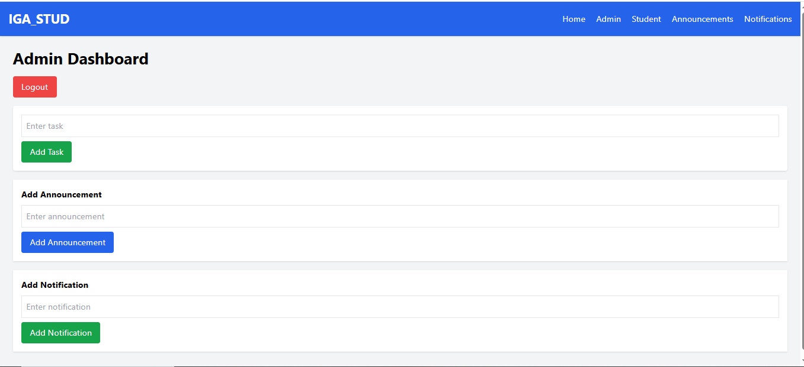
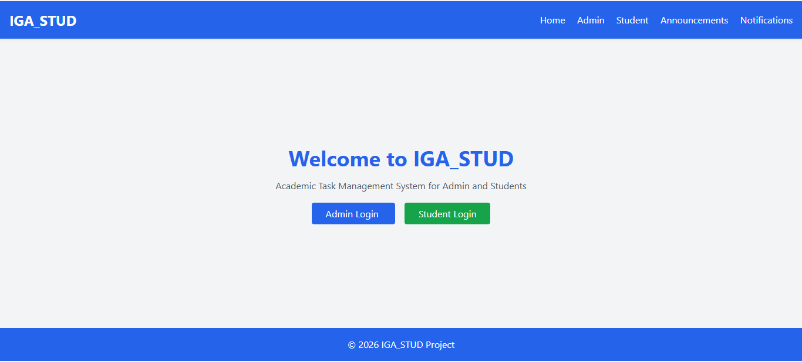
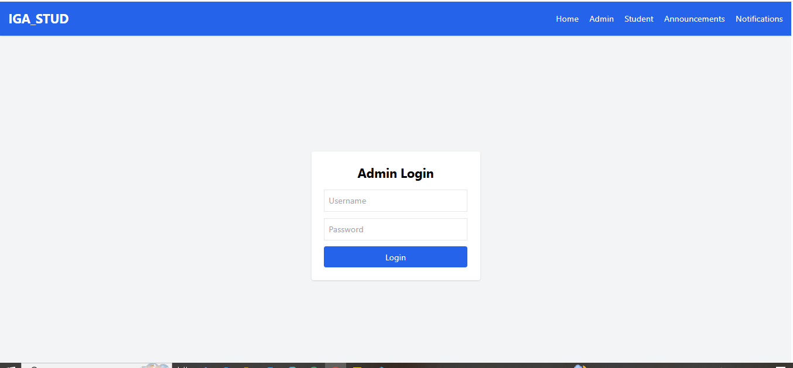
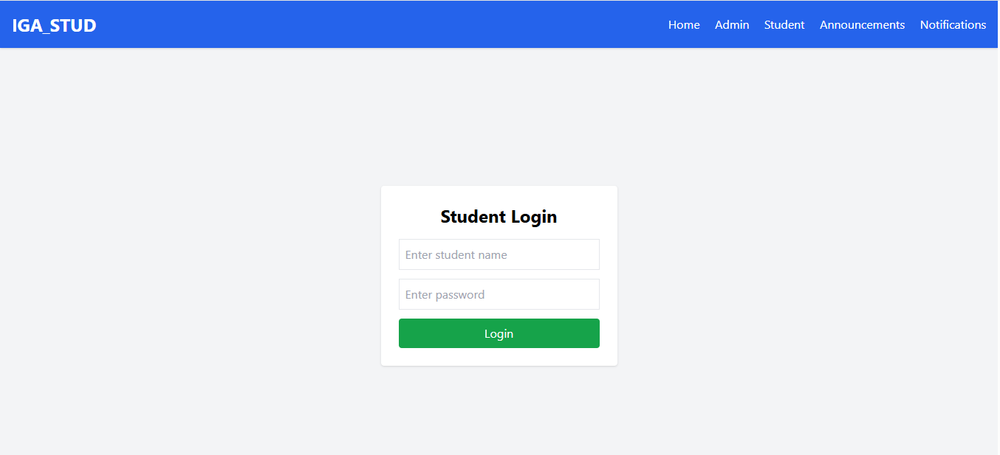
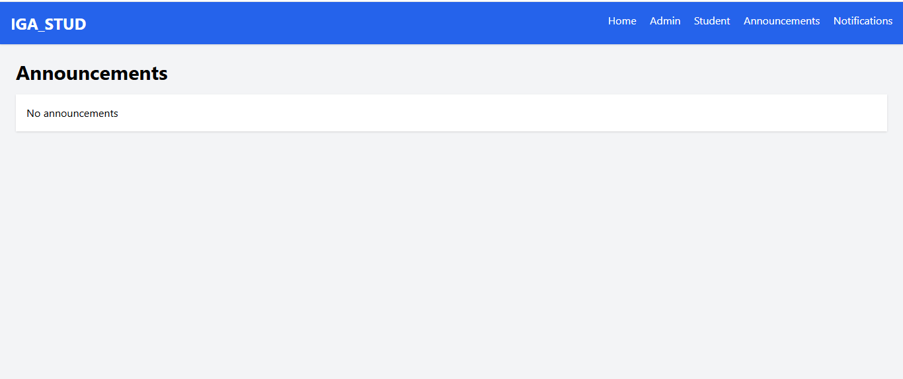

## IGA_STUD – Academic Task Management System (Frontend Only)

## Project Description

**IGA_STUD** is a frontend-only academic task management website built using **HTML, Tailwind CSS And few Javascript**. The system allows an **Admin** to manage tasks, announcements, and notifications, and allows **Students** to view and complete assigned tasks.

This project does not use any backend or database. All data is stored locally in the browser using **localStorage**.

---

## Project Objectives

* Provide a simple academic management interface
* Allow Admin to manage tasks, announcements, and notifications
* Allow Students to view and complete tasks
* Practice frontend development using HTML, Tailwind CSS, and JavaScript
* Simulate a real academic system without backend

---

## Technologies Used

* HTML5 – Structure
* Tailwind CSS (CDN) – Styling and responsive design
* JavaScript (Internal) – Interactivity and logic
* localStorage – Data storage in browser

---

## Project Structure

```
IGA_STUD/
│
├── index.html           → Home Page
├── admin.html           → Admin Login and Dashboard
├── student.html         → Student Login and Dashboard
├── announcements.html   → View Announcements
├── notifications.html   → View Notifications
└── README.md            → Project Documentation
```

---

##  Admin Features

Admin can:

* Login using username and password
* Add new tasks
* Delete tasks
* Add announcements
* Add notifications
* Manage academic information

### Admin Login Credentials

---
Username: admin
Password: 1234


---

##  Student Features

Student can:

* Login using name and password
* View assigned tasks
* Mark tasks as completed
* View announcements
* View notifications

---

##  Data Storage

This project uses **localStorage**, which allows:

* Saving tasks
* Saving announcements
* Saving notifications
* Sharing data between pages

No backend or database.

---

## 🖥 How to Run the Project

1. Download or copy the project folder
2. Open the folder
3. Double-click on `index.html`

OR

Right-click → Open with browser

Recommended browsers:

* Google Chrome
* Microsoft Edge

---

## Responsive Design

The website is fully responsive and works on:

* Desktop
* Tablet
* Mobile devices

---

## Educational Purpose

This project is designed for:

* Frontend practice
* Academic submission
* Learning HTML, Tailwind CSS, and JavaScript
* Understanding frontend-only systems

---

## Future Improvements

Possible upgrades:

* Backend integration (PHP, Node.js)
* Database (MySQL, MongoDB)
* User authentication system
* Real-time notifications
* Student registration system

---

## Author
Author Name: MUNYAWERA Anaclet
REG No: 25RP00508
Project Name: IGA_STUD
Developer: Student Project
Technology: HTML, Tailwind CSS, JavaScript

---
## Screenshot
      **admin_dashboard**
    **home_page**
    **admin_login**
    **student_login**
    **announcements**


---
## Conclusion

IGA_STUD is a simple and effective frontend academic management system that demonstrates core frontend development skills and simulates real-world academic functionality.

---
